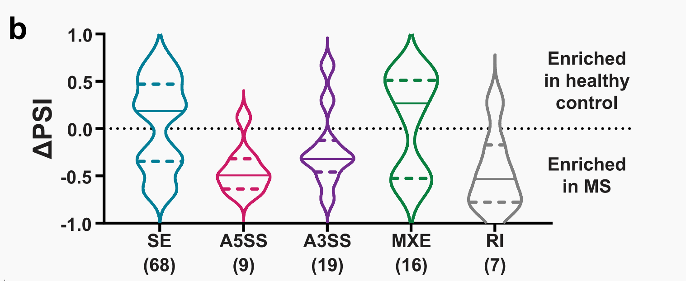
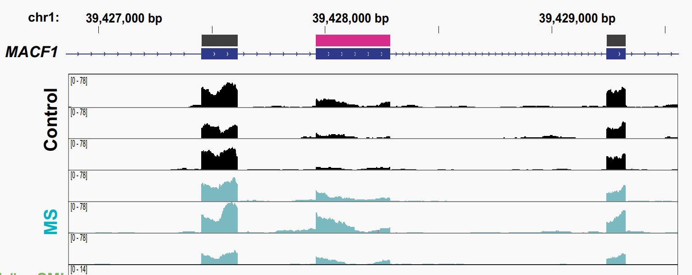

Title: hnRNP A1 dysfunction alters RNA splicing and drives neurodegeneration in multiple sclerosis (MS)
Date: 2024-01-13
Category: 論文
Tags: 2024, article, splicing, neurodegeneration, hnRNP A1
Summary: hnRNP A1の機能不全はRNAスプライシングを変化させ、多発性硬化症（MS）における神経変性を引き起こす
Slug: 2024-01-13-Salapa2024

# 論文情報

Salapa, Hannah E et al. “hnRNP A1 dysfunction alters RNA splicing and drives neurodegeneration in multiple sclerosis (MS).” *Nature communications* vol. 15,1 356. 8 Jan. 2024, doi:[10.1038/s41467-023-44658-1](http://dx.doi.org/10.1038/s41467-023-44658-1)

コピーライト: [CC BY 4.0 DEED](https://creativecommons.org/licenses/by/4.0/deed.ja)

# 総論 ([paper-interpreter](https://chat.openai.com/g/g-hxDOCBQrs-paper-interpreter-japanese)を加筆・修正)

## 著者情報

責任著者のDr. Michael C. Levinは、現在カナダのサスカチュワン大学医学部の神経学および解剖学、生理学、薬理学の教授であり、サスカチュワン多発性硬化症臨床研究チェアを務めています。本研究の主題であるhnRNP A1の局在の異常を初めて報告しています [Levin (2002)](http://dx.doi.org/10.1038/nm0502-509)。

## アブストラクト
この研究は、多発性硬化症(MS)における神経変性の主要な進行要因であるRNA結合タンパク質hnRNP A1の機能不全がRNAの代替的スプライシングを引き起こし、MSとそのマウスモデルにおける神経変性に寄与することを明らかにしています。MS脳のRNAシーケンス分析により、神経機能とRNA恒常性に関わるhnRNP A1標的RNAの異常な発現とスプライシングを同定しました。さらに、hnRNP A1の機能不全による神経突起の損失とスプライシングの変化を、CRISPR/Cas9によるhnRNP A1のノックアウトで確認しました。これらのデータは、MSにおけるhnRNP A1の機能不全がRNA代謝を乱し、神経変性を促進するメカニズムを示唆しています。

## 背景

多発性硬化症(MS)における神経変性は、ニューロンと軸索の損傷と喪失により進行し、障害の重大な原因となっています。MSの神経変性病理学は、炎症、シナプス喪失、グルタミン酸毒性、ミトコンドリア機能不全など、複数の並行するプロセスによって特徴づけられています。RNA結合タンパク質(RBP)の機能不全は、これらの病態におけるRNA代謝の変化に関与しており、MSにおける新たな神経変性メカニズムとして提唱されています。

## 方法

hnRNP A1の機能不全がMS皮質とEAE(実験的自己免疫性脳脊髄炎)におけるRNA代謝に与える影響を、全RNAシーケンス(RNAseq)とUVクロスリンキング免疫沈降法に続くRNAシーケンス(CLIPseq)を用いて調査しました。MS患者の皮質からのサンプルと健康な対照者のサンプルを比較し、hnRNP A1の機能不全によって影響を受ける可能性のある経路と代替的RNAスプライシングイベントを同定しました。その後、EAEマウスの脊髄でCLIPseq実験を行い、hnRNP A1のRNA結合プロファイルの変化を含む、ヒトサンプルで同定された発現変動遺伝子およびスプライシングの変動を確認しました。また、機能不全のhnRNP A1変異体を用いて一次培養マウス大脳皮質ニューロンをトランスデュースすることで、hnRNP A1の機能不全がニューロンに与える影響を直接結びつけました。

## 結果
MS脳皮質におけるhnRNP A1のミスローカリゼーションは、神経変性を示唆する変化したRNA発現プロファイルに関連していました。約550の異なる発現遺伝子が特定され、そのうち359はアップレギュレート、192はダウンレギュレートされました。これらのうち80%以上がhnRNP A1によって結合されることが既に示されていることが明らかになりました。ゲノムオントロジー(GO)分析により、代替的スプライシング、核酸結合、リボ核酸代謝プロセスなどの用語が有意に豊富であることが示され、これらはMSの病理において重要な役割を果たしていることが示唆されました。

EAEマウスの脊髄でhnRNP A1のRNA結合プロファイルが変化していることが確認されました。EAEの重症度に応じて、hnRNP A1によって結合される遺伝子やクラスターの数が減少する傾向が見られました。これは、hnRNP A1がAGリッチ領域に特異的に結合することを示しており、結合嗜好がEAEサンプルで変化していることを示唆しています。これらの結果は、hnRNP A1の機能不全が神経変性に関与するメカニズムの一部である可能性を示しています。

## 議論

hnRNP A1の機能不全は、代替的RNAスプライシングの変化と神経変性表現型の促進につながります。特にPKM/Pkm遺伝子の代替的スプライシングイベントがMS脳とEAEサンプルで確認され、hnRNP A1(F263S)変異体を用いた一次培養ニューロンシステムでこれが再現されました。この変異はhnRNP A1の機能不全を引き起こし、スプライシングの変化に繋がることが示されました。さらに、rMATSを使用してMS皮質サンプルから新たなhnRNP A1によって調節される代替的スプライシングイベントを広範囲にプロファイルし、特定しました。これには、96の異なる遺伝子における119の有意な代替的スプライシングイベントが含まれており、これらの多くがhnRNP A1によってスプライシングされたり結合されたりすることが以前から知られていました。選択されたスプライシングイベントの検証には、ABI2を含むhnRNP A1に結合する関連ターゲットでのアンプリコンPCRが使用されました。

# 読後感

+ hnRNP A1の機能不全を最初に報告してから22年間、それを中心に継続して研究に取り組む点にまず驚きました。研究活動は地道なものであることを感じました。
+ 本研究のまとめとしてあるべき、hnRNP A1(F263S)変異体を導入したニューロンで病理が再現される、という図がメインではなくサプリにあるのか、違和感を感じました。
+ なぜ、hnRNP A1の異常な局在が起こるのか、という点については、本研究では明らかにされていません。

+ ところどころで、hnRNP A1によるスプライシングの異常が、実はあまり変動していないことを感じさせるFigureとなっています
  + 著者がDiscussionで、「hnRNP A1によって複数因子が摂動を受け、MSが起こる」と書かれているのは、このようなFigureの説明にもなっている気がします。

> Fig 4BによるrMATSのスプライシング変動遺伝子の数がかなり少ないことがわかります。論文にはFDR閾値の記載がなかったので詳細は不明です。
> 

> Fig 5AのControlとMSのMAFCF1におけるRNA発現量の比較ですが、率直には微々たる差であると感じます。
> 

# その他

### ヒトとマウスでは発現変動遺伝子、スプライシング変動がどれくらい共通するのか？

- 記載なし

## 手法

### RNA-EMSAって何？

- RNA-EMSA（RNA電気泳動シフトアッセイ）は、RNA分子とそれらが結合するタンパク質や他の分子との相互作用を研究するための実験手法です。この方法では、特定のRNA分子とタンパク質を混合し、その複合体をゲル電気泳動で分離します。RNAとタンパク質が結合すると、その複合体の移動速度が変わり、ゲル上での位置が変化します。この変化を検出することで、RNAとタンパク質の相互作用を解析することができます。RNA-EMSAは、RNAの機能的役割やRNA-タンパク質相互作用の詳細を理解するために広く用いられています。
